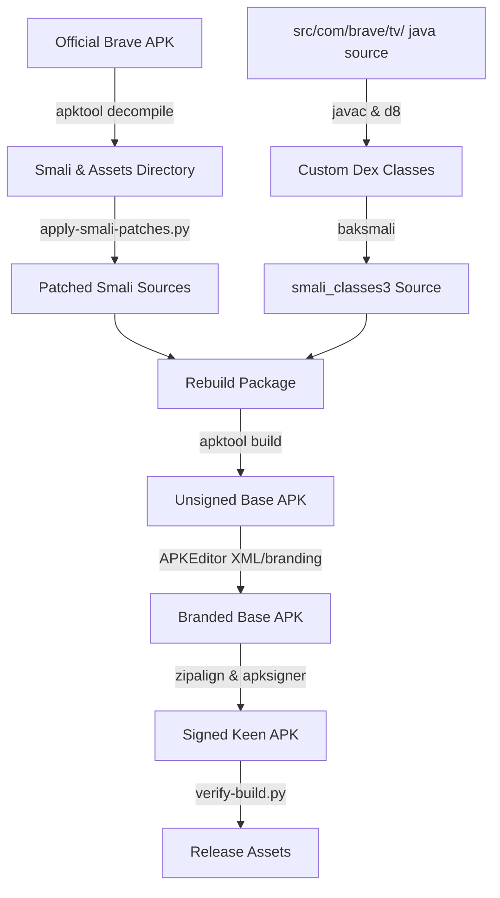

<p align="center">
  
</p>

<p align="center">
  <b>Keen Browser. Browse Untamed.</b>
</p>

Keen is Brave Browser rebuilt for Android TV.

Brave is a great privacy-focused browser, but it lacks an official Android TV app. Keen resolves this by integrating D-pad remote navigation and optimizing the layout for television displays, while keeping Brave's ad-blocking and privacy features intact.

---

## Features

- D-pad pointer with smooth movement, edge scrolling, and keyboard-aware input.
- Content-host lockdown blocking hijacked popups and unrelated full-page redirects.
- Remote-native Android dialogs and controls.
- Brave Shields and native ad blocking remain fully intact.

---

## Download

- **[64-bit version (arm64-v8a)](https://github.com/SirPrizeNZ/keen-browser/releases/download/v1.3.0/Keen-64.apk)** - Recommended for modern, high-performance devices.
- **[32-bit version (armeabi-v7a)](https://github.com/SirPrizeNZ/keen-browser/releases/download/v1.3.0/Keen-32.apk)** - Compatibility release for older streaming hardware and sticks.

---

## Device compatibility

| Architecture support | Device classification examples |
| :--- | :--- |
| 64-bit version (arm64-v8a) | Nvidia Shield TV Pro (2019+), Google TV Streamer (4K) |
| 32-bit version (armeabi-v7a) | Xiaomi TV Box S (Gen 2 & Gen 3), Walmart Onn 4K Pro, Chromecast with Google TV (4K & HD), Nvidia Shield TV (Tube version), Walmart Onn 4K Streaming Box |

---

## Technical specifications

- **Status**: Alpha / Experimental
- **Base APK version**: Brave Stable `v1.91.172` (`com.brave.browser`)

---

## Technical overview

### Modifications
- **D-pad cursor**: Native pointer simulation mapped directly to your D-pad remote.
- **TV launcher banner**: Integrated Leanback launcher category and custom TV banner resources.
- **UI cleanups**: Stripped out mobile-only menu items (Brave Rewards, News, VPN, Wallet, Leo AI) to prevent D-pad remote focus hangs.
- **Navigation lockdown**: Content sites stay on their own host. Cross-site popup hijacks are blocked at Chromium's native navigation hooks.

### Unmodified features
- Core Chromium rendering engine.
- Brave Shields and native ad-block lists.

### Key permissions
- `INTERNET` (Web access)
- `ACCESS_NETWORK_STATE` & `ACCESS_WIFI_STATE` (Connection checks)
- `READ_EXTERNAL_STORAGE` & `WRITE_EXTERNAL_STORAGE` (Downloads support)
- `RECORD_AUDIO` & `CAMERA` (Web audio/video features)

### Known limitations
- **Manual updates**: Since this is a custom patched build, it won't auto-update from the Play Store.
- **Custom signing**: Will trigger an Android security warning on installation.

---

## How to install (Android TV)

1. Download the correct version of Keen for your TV device on a phone or computer.
2. Send the APK file to your TV using a USB drive or an app like Send Files to TV.
3. On your TV, open a File Manager app, find the APK, and install it. Allow installation from unknown sources in settings if prompted.

---

## Security and privacy policy

All patches are strictly for UI layout, D-pad controls, and TV optimization. Brave's core Chromium engine, sandboxing, and native adblockers are untouched.

Because this is a modified build, it is signed with a custom development certificate instead of Brave's official signature.

---

## System architecture and patching pipeline

The project uses a patching pipeline to inject TV behavior into the official Brave build, bypassing the need to maintain a heavy Chromium source fork.



### Why this isn't a source fork
Compiling Chromium and Brave from source requires a high-end machine, hundreds of gigabytes of disk space, and takes hours per build. Keeping it updated with upstream security patches is also difficult. The patching pipeline automates the modification of official upstream binaries, keeping the browser secure with minimal overhead.

---

## Building from source

### Prerequisites
- macOS or Linux
- JDK 8 or higher
- Android SDK (with `d8`, `apksigner`, `zipalign`, and platform jar 36)
- Python 3
- Node.js
- `apktool` installed on your PATH

### Build instructions

1. Place the original Brave APKs inside the `original/` folder:
   - 32-bit: `original/BraveMonoarm.apk`
   - 64-bit: `original/BraveMonoarm64.apk`
2. Run the build script:
   ```bash
   ./tools/build-patch.sh
   ```
3. Find your finished APKs in the `build/` folder:
   - `build/Keen-32.apk`
   - `build/Keen-64.apk`

---

## Author

Built by **SirPrizeNZ** (https://github.com/SirPrizeNZ).

*Disclaimer: Unofficial community port of Brave Browser. Not affiliated with or endorsed by Brave Software Inc.*

